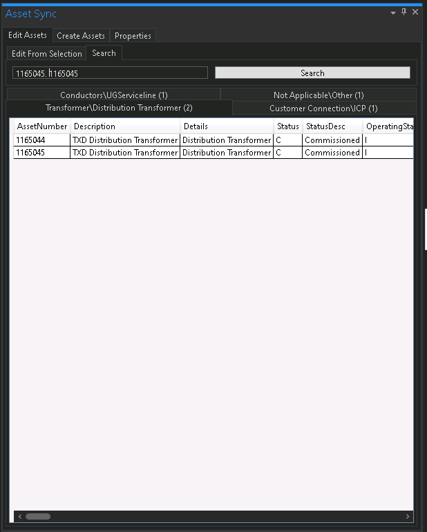

# ArcGIS Pro - TechnologyOne Asset Editor Add-in

An integrated ArcGIS Pro Add-in for TechnologyOne.

### Why?

The client currently uses TechnologyOne for their asset management and tracking software, and ArcGIS Pro for geospatial analysis and tracking.

The main reason for this software being built was because there was no currently available add-ins that did the required functions of editing, creating and viewing TechnologyOne data from within ArcGIS Pro.

### Results

The results was a successful add-in that functions natively within ArcGIS Pro, using the TechnologyOne API. Editors can now easily edit, create and view details of assets from TechnologyOne within ArcGIS Pro.

### Features

- Native add-in to ArcGIS Pro, can be moved around, docked and resized as other windows.
- Ability to search and display assets from a textbox.
- Ability to get data on an asset based on selected feature(s).
- Editors can create new assets in TechnologyOne from a dropdown of templates.
- Can also create/duplicate new assets based on selected feature(s).
- Very easy to alter application properties.
- Editors can edit what fields are hidden or visible from within the add-in and save configurations.
- Authentication settings.

### Use

The tool works as a native ArcGIS Pro Add-in, completely written in C# and using the latest ArcGIS Pro SDK.

### Wrap Up

This tool is quite unique, as it reduces time for editors to edit, create and view assets. It also gets rid of a lot of copying, pasting and opening new windows by combining two pieces of software, which in itself saves lots of time, especially in batch processes.

### Screenshots

[Return Home](/)
