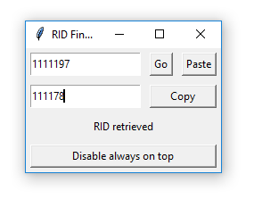
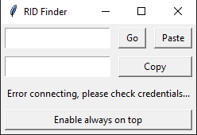

# TechnologyOne - Asset RID Finder

A lightweight tool to find asset RIDs based on an asset number.

### Why?

TechnologyOne made asset RIDs hidden with no practical way of making them visible again. The asset RID was used for specific functions in both FME and ArcMap Desktop.

### Results

A very simple UI application that used a simple SQL query to return the result.

### Features

- Very fast and lightweight.
- Gave editors the ability to paste directly.
- Always On Top toggle, to stop it from getting lost on your desktop.

### Use

The tool works completely standalone, so long as the database is online.

### Wrap Up

This tool could've been updated to handle multiple asset IDs and return multiple asset RIDs at the same time, however since this was a quick workaround, further features were not required.

### Screenshots

[Return Home](/)
