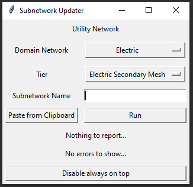
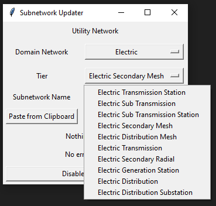
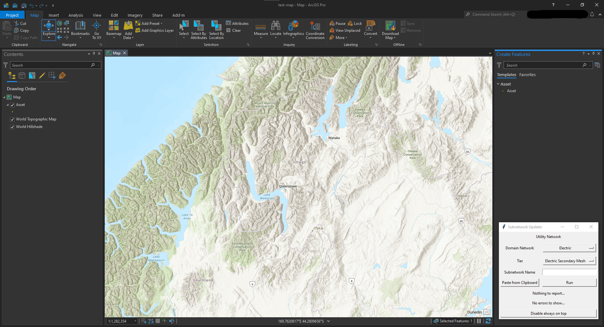

# ArcGIS Pro - Utility Network External Tool

A lightweight tool built in python to update subnetworks within the Utility Network.

### Why?

The traditional way of doing it through geoprocessing in ArcGIS Pro took roughly 15 minutes. This was from creating the subnetwork, validating the dirty areas around the subnetwork, and then the longest part; updating the subnetwork with the built-in tool.

Issues encountered were as such:

- If dirty areas were generated by ArcGIS due to bugs, larger subnetworks would take a long time to update, only to be met with an error, wasting lots of time.
- CPU and GPU usage on lower end machines skyrocketed, meaning even tasks outside of ArcGIS were slow, often unusable.
- To view performance, would usually have to go through ArcGIS log of events.

### Results

Using a basic computer (6th Gen i5, 8GB RAM, iGPU) paired to a development (but rather large) Utility Network server.

The target Utility Network manages roughly 4,100km of overhead and underground lines, covering an area of over 10,000km2.

| Subnetwork Size (averages)         | Before (average) | After (average) |
| ---------------------------------- | ---------------- | --------------- |
| Small (~30m, 2-4 devices)          | 13 minutes       | 15 seconds      |
| Large* (~100km, 1000's of devices) | 2 hours          | 9 minutes       |

*= Large subnetworks are harder to determine, but there is still a vast improvement over the traditional way.

### Features

- Much faster than the traditional way of updating subnetworks.
- Lightweight and very easy to use. Uses very few resources on top of actual computing (due to the fact it doesn't need to use the ArcGIS Pro UI thread).
- Performance report after each operation run - handy for checking speed and health of Utility Network.
- Ability to paste from clipboard, reducing the time spent typing in or misspelling subnetwork names.
- Easily customizable dropdowns for servers, domain networks, and tiers.
- Always On Top toggle, to stop it from getting lost on your desktop.

### Use

The tool works alongside ArcGIS as a 'standalone' tool, as seen in the screenshots below.

### Wrap Up

Hopefully this has covered subnetwork updater tool in some detail. If you're interested, get in touch.

### Screenshots

[Return Home](/)
